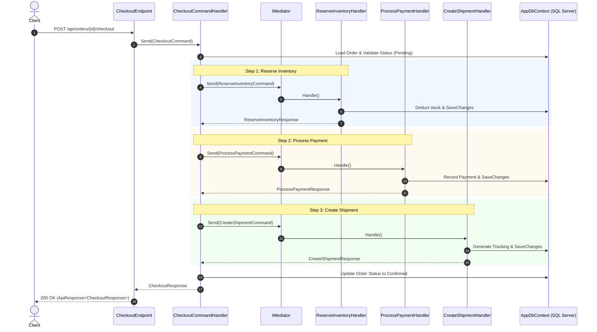

# E-Commerce Checkout API (Baseline — Before Orchestrator Pattern)

[](https://dotnet.microsoft.com/)
[]()
[]()

> **Notice**: This repository branch (`before-orchestrator-pattern`) intentionally demonstrates a production-grade CQRS and Vertical Slice architecture **BEFORE** introducing the Orchestrator Pattern. The multi-step Order Checkout flow here is implemented in a direct, synchronous command-chaining style to clearly exhibit the architectural coupling and maintainability challenges that motivate orchestration.

---

## Table of Contents
1. [Project Overview](#project-overview)
2. [Architectural Highlights](#architectural-highlights)
   - [Vertical Slice Architecture](#vertical-slice-architecture)
   - [CQRS (Command Query Responsibility Segregation)](#cqrs-command-query-responsibility-segregation)
   - [SOLID Principles Implementation](#solid-principles-implementation)
   - [Clean Code Standards](#clean-code-standards)
3. [Centralized Error Handling & JSON Standardization](#centralized-error-handling--json-standardization)
4. [The Baseline Order Checkout Flow](#the-baseline-order-checkout-flow)
5. [Architectural Pain Points (Why We Need an Orchestrator)](#architectural-pain-points-why-we-need-an-orchestrator)
6. [Project Structure](#project-structure)
7. [Domain & Seed Data](#domain--seed-data)
8. [Getting Started & Running the API](#getting-started--running-the-api)
9. [Running Tests](#running-tests)
10. [Example API Requests & Responses](#example-api-requests--responses)
11. [What's Next: The Orchestrator Pattern](#whats-next-the-orchestrator-pattern)

---

## Project Overview

This project implements a realistic e-commerce order processing backend using **ASP.NET Core Web API**, **Entity Framework Core (SQL Server)**, **MediatR**, and **FluentValidation**.

### Business Scenario: Order Checkout
A customer initiates checkout for an existing order, triggering the following sequence:
1. **Validation**: Verify that the order exists, has items, and is in `Pending` state.
2. **Inventory Reservation**: Check catalog stock and decrement inventory for each line item.
3. **Payment Processing**: Authorize and capture payment via payment provider simulation.
4. **Shipment Creation**: Validate destination address, book carrier, and generate tracking number.
5. **Confirmation**: Transition the order status to `Confirmed`.

---

## Architectural Highlights

### Vertical Slice Architecture
Instead of traditional horizontal technical layers (`Controllers/`, `Services/`, `Repositories/`, `DTOs/`), the solution is partitioned along business feature boundaries. Every feature slice is self-contained and encapsulates:
- Command / Query definition
- Request Handler (application logic)
- FluentValidation Validator
- Response / DTO models
- Minimal API Endpoint route mapping

```
Features/
├── Orders/
│   ├── Commands/
│   │   ├── CreateOrder/
│   │   └── Checkout/
│   └── Queries/
│       ├── GetOrderById/
│       ├── GetOrderStatus/
│       └── GetOrders/
├── Inventory/
│   ├── Commands/ReserveInventory/
│   └── Queries/GetProductStock/
├── Payments/
│   └── Commands/ProcessPayment/
└── Shipping/
    └── Commands/CreateShipment/
```

### CQRS (Command Query Responsibility Segregation)
- **Commands**: Mutate state and return outcome models (e.g., `CreateOrderCommand`, `ReserveInventoryCommand`, `ProcessPaymentCommand`, `CreateShipmentCommand`, `CheckoutCommand`).
- **Queries**: Pure read-only operations using EF Core `.AsNoTracking()` projections without side effects (e.g., `GetOrderByIdQuery`, `GetOrderStatusQuery`, `GetOrdersQuery`, `GetProductStockQuery`).
- In-process dispatching is handled via **MediatR**.

### SOLID Principles Implementation
- **Single Responsibility (SRP)**: Each handler focuses on a single business action (e.g., `ReserveInventoryHandler` only manipulates product stock).
- **Open/Closed (OCP)**: New query/command slices can be added without modifying existing unrelated slices.
- **Dependency Inversion (DIP)**: Endpoints and handlers depend on clean abstractions (`ISender`, `AppDbContext`, `ILogger`).
- **Interface Segregation (ISP)**: Lean handler interfaces (`IRequestHandler<TRequest, TResponse>`).

### Clean Code Standards
- Guard clauses and domain validation.
- Strongly-typed C# 13 records and immutability.
- No magic numbers or magic strings (centralized `ErrorCodes` and strongly-typed domain Enums).
- Async/await with `CancellationToken` propagation throughout all async paths.
- Clean EF Core Fluent API mappings with precision, indexes, foreign keys, and cascading rules.

---

## Centralized Error Handling & JSON Standardization

All endpoints return a uniform envelope model regardless of whether the operation succeeded or failed.

### Success Response Contract (`ApiResponse<T>`)
```json
{
  "success": true,
  "data": {
    "orderId": "3fa85f64-5717-4562-b3fc-2c963f66afa6",
    "orderStatus": "Confirmed",
    "totalAmount": 1999.97
  },
  "error": null,
  "traceId": "00-464e347cf40a9823bbef24c2b89e0ca5-6d7014e860005342-00"
}
```

### Error Response Contract (`ApiResponse<T>`)
```json
{
  "success": false,
  "data": null,
  "error": {
    "code": "INSUFFICIENT_INVENTORY",
    "message": "Insufficient inventory for product 'Pro Performance Laptop 16\"' (SKU: TECH-LAPTOP-001). Requested: 100, Available: 25.",
    "details": null
  },
  "traceId": "00-464e347cf40a9823bbef24c2b89e0ca5-6d7014e860005342-00"
}
```

### Exception Hierarchy & Global Exception Handler
ASP.NET Core 9's `IExceptionHandler` (`GlobalExceptionHandler`) intercepts domain exceptions and maps them to HTTP status codes and RFC 7807 problem payloads without leaking stack traces:
- `NotFoundException` $\rightarrow$ **404 Not Found** (`NOT_FOUND`, `ORDER_NOT_FOUND`, `PRODUCT_NOT_FOUND`)
- `ValidationException` $\rightarrow$ **400 Bad Request** (`VALIDATION_ERROR` with field details)
- `ConflictException` $\rightarrow$ **409 Conflict** (`RESOURCE_CONFLICT`)
- `DomainException` $\rightarrow$ **422 Unprocessable Entity** (`INSUFFICIENT_INVENTORY`, `PAYMENT_DECLINED`, `INVALID_SHIPPING_ADDRESS`)
- `Unhandled Exception` $\rightarrow$ **500 Internal Server Error** (`INTERNAL_SERVER_ERROR` with sanitized message)

---

## The Baseline Order Checkout Flow

In this branch, `CheckoutCommandHandler` coordinates the multi-step flow directly:



---

## Architectural Pain Points (Why We Need an Orchestrator)

While this baseline architecture is clean and functional, implementing a multi-step distributed business transaction directly inside a standard Command Handler exposes serious architectural flaws as requirements grow:

### 1. High Cognitive Load & Violation of SRP
The `CheckoutCommandHandler` is doing too much:
- Managing checkout logic
- Orchestrating cross-domain calls
- Handling failure detection across three different domains
- Executing manual compensating actions (restoring inventory stock, updating payment status, updating order failure state)

### 2. Tight Temporal & Synchronous Coupling
The handler directly couples the Orders domain to the Inventory, Payments, and Shipping domains. If any step changes its signature, preconditions, or failure semantics, the checkout handler breaks.

### 3. Fragile Procedural Rollback (Compensation Spaghetti)
In the catch block of `CheckoutCommandHandler`:
```csharp
// Manual rollback logic mixed with execution logic
if (inventoryReserved)
{
    foreach (var item in order.Items)
    {
        item.Product?.ReleaseStock(item.Quantity);
    }
}
if (paymentProcessed && order.Payment != null)
{
    order.Payment.Status = PaymentStatus.Refunded;
}
order.Status = OrderStatus.Failed;
```
If the server crashes midway through a step, there is **no persistent state machine** or step tracking to know where the transaction stopped or how to resume/compensate safely.

### 4. Poor Extensibility (Violation of OCP)
Adding a new step (e.g., *Fraud Check*, *Apply Loyalty Points*, *Send Confirmation Email*, *Export to Warehouse WMS*) requires directly modifying `CheckoutCommandHandler`, increasing regression risk.

### 5. Testing Complexity
Testing `CheckoutCommandHandler` requires mocking every downstream command and testing combinatorial failure and rollback branches in a single massive unit test suite.

---

## Project Structure

```
Orchestrator-Pattern-In-CQRS/
├── OrchestratorPattern.sln
├── src/
│   └── OrchestratorPattern.Api/
│       ├── Common/
│       │   ├── Behaviors/
│       │   │   └── ValidationBehavior.cs
│       │   ├── Constants/
│       │   │   └── ErrorCodes.cs
│       │   ├── Domain/
│       │   │   ├── Entities/
│       │   │   │   ├── Customer.cs
│       │   │   │   ├── Product.cs
│       │   │   │   ├── Order.cs
│       │   │   │   ├── OrderItem.cs
│       │   │   │   ├── Payment.cs
│       │   │   │   └── Shipment.cs
│       │   │   └── Enums/
│       │   │       ├── OrderStatus.cs
│       │   │       ├── PaymentStatus.cs
│       │   │       ├── ShipmentStatus.cs
│       │   │       └── PaymentMethod.cs
│       │   ├── Exceptions/
│       │   │   ├── AppException.cs
│       │   │   ├── NotFoundException.cs
│       │   │   ├── ValidationException.cs
│       │   │   ├── ConflictException.cs
│       │   │   └── DomainException.cs
│       │   ├── Middleware/
│       │   │   └── GlobalExceptionHandler.cs
│       │   ├── Models/
│       │   │   ├── ApiResponse.cs
│       │   │   └── ApiError.cs
│       │   └── Persistence/
│       │       ├── AppDbContext.cs
│       │       ├── Configurations/
│       │       ├── Migrations/
│       │       └── Seed/
│       │           └── DatabaseSeeder.cs
│       ├── Features/
│       │   ├── Orders/
│       │   │   ├── Commands/
│       │   │   │   ├── CreateOrder/
│       │   │   │   └── Checkout/
│       │   │   ├── Queries/
│       │   │   │   ├── GetOrderById/
│       │   │   │   ├── GetOrderStatus/
│       │   │   │   └── GetOrders/
│       │   │   └── OrderEndpoints.cs
│       │   ├── Inventory/
│       │   │   ├── Commands/ReserveInventory/
│       │   │   ├── Queries/GetProductStock/
│       │   │   └── InventoryEndpoints.cs
│       │   ├── Payments/
│       │   │   ├── Commands/ProcessPayment/
│       │   │   └── PaymentEndpoints.cs
│       │   └── Shipping/
│       │       ├── Commands/CreateShipment/
│       │       └── ShippingEndpoints.cs
│       ├── appsettings.json
│       ├── appsettings.Development.json
│       └── Program.cs
└── tests/
    └── OrchestratorPattern.Tests/
        ├── Common/
        │   ├── TestDbContextFactory.cs
        │   └── CustomWebApplicationFactory.cs
        ├── Unit/
        │   ├── Orders/
        │   ├── Inventory/
        │   ├── Payments/
        │   ├── Shipping/
        │   └── Validation/
        └── Integration/
            ├── CheckoutFlowIntegrationTests.cs
            ├── OrdersApiIntegrationTests.cs
            ├── InventoryApiIntegrationTests.cs
            ├── PaymentsApiIntegrationTests.cs
            └── ShippingApiIntegrationTests.cs
```

---

## Domain & Seed Data

On startup, `DatabaseSeeder` populates the database with deterministic records:

### Customers
| Customer ID | Full Name | Email |
| :--- | :--- | :--- |
| `11111111-1111-1111-1111-111111111111` | Alice Johnson | `alice.johnson@example.com` |
| `22222222-2222-2222-2222-222222222222` | Bob Smith | `bob.smith@example.com` |

### Products
| Product ID | SKU | Name | Price | Initial Stock |
| :--- | :--- | :--- | :--- | :--- |
| `aaaaaaaa-aaaa-aaaa-aaaa-aaaaaaaaaaaa` | `TECH-LAPTOP-001` | Pro Performance Laptop 16" | $1,499.99 | 25 |
| `bbbbbbbb-bbbb-bbbb-bbbb-bbbbbbbbbbbb` | `TECH-PHONE-002` | UltraSmart Phone 5G | $899.99 | 50 |
| `cccccccc-cccc-cccc-cccc-cccccccccccc` | `TECH-AUDIO-003` | Noise-Cancelling Headphones | $249.99 | 100 |
| `dddddddd-dddd-dddd-dddd-dddddddddddd` | `TECH-LIMITED-004` | Limited Edition Keyboard | $199.99 | 0 *(Out of Stock)* |

---

## Getting Started & Running the API

### Prerequisites
- [.NET 9.0 SDK](https://dotnet.microsoft.com/download)
- SQL Server LocalDB (`(localdb)\mssqllocaldb`) or standard SQL Server

### 1. Clone & Checkout Branch
```powershell
git checkout before-orchestrator-pattern
```

### 2. Apply EF Core Migrations
```powershell
dotnet ef database update --project src/OrchestratorPattern.Api/OrchestratorPattern.Api.csproj
```

### 3. Run the API
```powershell
dotnet run --project src/OrchestratorPattern.Api/OrchestratorPattern.Api.csproj
```

### 4. Interactive Swagger UI
Open your browser and navigate to:
```
http://localhost:5000/
```

---

## Running Tests

Execute all 36 unit and end-to-end integration tests:

```powershell
dotnet test --logger "console;verbosity=detailed"
```

---

## Example API Requests & Responses

### 1. Create a New Order (`POST /api/orders`)
**Request:**
```http
POST /api/orders HTTP/1.1
Content-Type: application/json

{
  "customerId": "11111111-1111-1111-1111-111111111111",
  "items": [
    {
      "productId": "aaaaaaaa-aaaa-aaaa-aaaa-aaaaaaaaaaaa",
      "quantity": 1
    },
    {
      "productId": "cccccccc-cccc-cccc-cccc-cccccccccccc",
      "quantity": 2
    }
  ]
}
```

**Response (`201 Created`):**
```json
{
  "success": true,
  "data": {
    "orderId": "6c5f7823-149b-449e-b7f3-2391b1a7741d",
    "customerId": "11111111-1111-1111-1111-111111111111",
    "customerName": "Alice Johnson",
    "status": "Pending",
    "totalAmount": 1999.97,
    "items": [
      {
        "productId": "aaaaaaaa-aaaa-aaaa-aaaa-aaaaaaaaaaaa",
        "productName": "Pro Performance Laptop 16\"",
        "sku": "TECH-LAPTOP-001",
        "unitPrice": 1499.99,
        "quantity": 1,
        "totalPrice": 1499.99
      },
      {
        "productId": "cccccccc-cccc-cccc-cccc-cccccccccccc",
        "productName": "Noise-Cancelling Wireless Headphones",
        "sku": "TECH-AUDIO-003",
        "unitPrice": 249.99,
        "quantity": 2,
        "totalPrice": 499.98
      }
    ],
    "createdAt": "2026-08-29T13:00:00.0000000Z"
  },
  "error": null,
  "traceId": "00-6c5f7823149b449eb7f32391b1a7741d-00"
}
```

---

### 2. Checkout Order — Success Flow (`POST /api/orders/{id}/checkout`)
**Request:**
```http
POST /api/orders/6c5f7823-149b-449e-b7f3-2391b1a7741d/checkout HTTP/1.1
Content-Type: application/json

{
  "paymentMethod": "CreditCard",
  "cardNumber": "4111111111111111",
  "shippingAddress": "123 Innovation Drive, Austin, TX 78701",
  "carrier": "FedEx"
}
```

**Response (`200 OK`):**
```json
{
  "success": true,
  "data": {
    "orderId": "6c5f7823-149b-449e-b7f3-2391b1a7741d",
    "customerId": "11111111-1111-1111-1111-111111111111",
    "customerName": "Alice Johnson",
    "orderStatus": "Confirmed",
    "totalAmount": 1999.97,
    "payment": {
      "paymentId": "7e14a1c5-cf9a-41be-94bc-87c26dfcfb08",
      "amount": 1999.97,
      "method": "CreditCard",
      "status": "Paid",
      "transactionId": "txn_8b1dc46a782b43b1981a8b1ef23"
    },
    "shipment": {
      "shipmentId": "8b9a11ef-934c-41ad-99f1-a1b7e43cd189",
      "trackingNumber": "FDX-A1B2C3D4E5F6G7",
      "carrier": "FedEx",
      "shippingAddress": "123 Innovation Drive, Austin, TX 78701",
      "status": "Created"
    },
    "completedAt": "2026-08-29T13:01:00.0000000Z"
  },
  "error": null,
  "traceId": "00-8b9a11ef934c41ad99f1a1b7e43cd189-00"
}
```

---

### 3. Checkout Order — Payment Declined Simulation (`POST /api/orders/{id}/checkout`)
Using card number ending in `0000` or `9999` triggers simulated payment decline:

**Request:**
```http
POST /api/orders/6c5f7823-149b-449e-b7f3-2391b1a7741d/checkout HTTP/1.1
Content-Type: application/json

{
  "paymentMethod": "CreditCard",
  "cardNumber": "4000000000000000",
  "shippingAddress": "123 Innovation Drive, Austin, TX 78701",
  "carrier": "FedEx"
}
```

**Response (`422 Unprocessable Entity`):**
```json
{
  "success": false,
  "data": null,
  "error": {
    "code": "PAYMENT_DECLINED",
    "message": "Payment was declined by payment provider. Please verify your payment details and try again.",
    "details": null
  },
  "traceId": "00-1c3905a76f254fca873ad9823e59a112-00"
}
```
*Note: The handler automatically rolls back the reserved product inventory and sets the order status to `Failed`.*

---

## What's Next: The Orchestrator Pattern

In the upcoming branch:

```
before-orchestrator-pattern  ───►  after-orchestrator-pattern
```

We will refactor this checkout process to use the **Orchestrator Pattern**:
- Decouple the `CheckoutCommandHandler` from downstream domain command execution.
- Introduce discrete, testable checkout workflow steps.
- Provide declarative compensation / rollback handlers for every step.
- Track workflow execution state cleanly.
- Ensure strict adherence to the Open/Closed Principle when adding new checkout business requirements.
