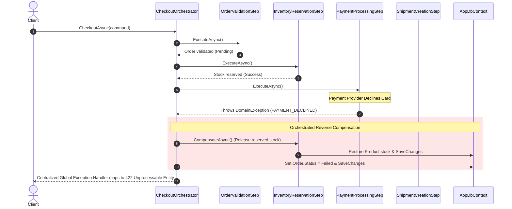

# E-Commerce Checkout API (With Orchestrator Pattern)

[](https://dotnet.microsoft.com/)
[]()
[]()

> **Notice**: This repository branch (`after-orchestrator-pattern`) demonstrates the completed migration to the **Orchestrator Pattern**. The multi-step Order Checkout workflow is now cleanly decoupled into focused, testable step components coordinated by a dedicated `CheckoutOrchestrator` with explicit reverse compensation.

---

## Table of Contents
1. [Overview](#overview)
2. [Why Was an Orchestrator Needed?](#why-was-an-orchestrator-needed)
3. [The Orchestrator Pattern Architecture](#the-orchestrator-pattern-architecture)
   - [Target Workflow Diagram](#target-workflow-diagram)
   - [Core Principle](#core-principle)
4. [Failure & Compensation Flow](#failure--compensation-flow)
5. [Before vs. After Comparison](#before-vs-after-comparison)
6. [Design Principles & SOLID Adherence](#design-principles--solid-adherence)
7. [Project Structure](#project-structure)
8. [Transaction & Consistency Strategy](#transaction--consistency-strategy)
9. [Getting Started & Running the API](#getting-started--running-the-api)
10. [Running Automated Tests](#running-automated-tests)
11. [Example API Requests & Responses](#example-api-requests--responses)

---

## Overview

This project implements a production-grade e-commerce backend built with **ASP.NET Core Web API**, **Entity Framework Core (SQL Server)**, **MediatR**, and **FluentValidation**.

In this branch, the **Order Checkout** process (a multi-step business transaction spanning **Orders**, **Inventory**, **Payments**, and **Shipping**) has been migrated from a monolithic command handler to the **Orchestrator Pattern**.

---

## Why Was an Orchestrator Needed?

In the baseline version (`before-orchestrator-pattern`), the `CheckoutCommandHandler` was directly responsible for invoking and coordinating multiple cross-domain operations. As business requirements expanded, this led to several severe architectural limitations:

### 1. Growing Handler Complexity
The handler was forced to manage validation, domain step invocations, state accumulation, and complex conditional error branching within a single method.

### 2. High Coupling Between Bounded Contexts
The Orders feature slice was tightly coupled to the exact calling conventions and temporal dependencies of Inventory, Payments, and Shipping.

### 3. Multiple Responsibilities (SRP Violation)
The handler was simultaneously acting as:
- An endpoint command dispatcher
- A workflow coordinator
- A business rule validator
- A compensation / rollback manager
- An entity persistence manager

### 4. Fragile Procedural Compensation ("Rollback Spaghetti")
Handling step failures required nested `if/try/catch` procedural blocks inside the handler. If a downstream step failed (e.g., Payment declined), manual recovery was scattered and prone to race conditions or unhandled failure modes.

### 5. Combinatorial Testing Difficulty
Unit testing the checkout flow required mocking all external operations inside a single massive test fixture, making it cumbersome to verify individual step failures and compensating actions.

---

## The Orchestrator Pattern Architecture

The Orchestrator Pattern extracts workflow coordination into a dedicated coordinator (`CheckoutOrchestrator`) and discrete, single-purpose step components (`OrderValidationStep`, `InventoryReservationStep`, `PaymentProcessingStep`, `ShipmentCreationStep`, `FinalizeCheckoutStep`).

### Target Workflow Diagram

```mermaid
flowchart TD
    A[API Endpoint: POST /api/orders/{id}/checkout] --> B[Checkout Command]
    B --> C[Checkout Handler (Thin)]
    C --> D[Checkout Orchestrator]
    D --> E[Validate Order Step]
    E --> F[Reserve Inventory Step]
    F --> G[Process Payment Step]
    G --> H[Create Shipment Step]
    H --> I[Finalize Checkout Step]
    I --> J[Return Standard ApiResponse]
```

### Core Principle

> **Important**: *The Orchestrator coordinates the workflow; it does NOT own all the business logic.*

- The **Handler** only delegates the use case to the Orchestrator.
- The **Orchestrator** enforces the execution order, passes workflow context, and triggers compensation when errors occur.
- Each **Step Component** owns a single business capability (e.g., reserving stock, charging payment, booking a carrier).
- **Domain Entities** retain domain state and invariant rules.

---

## Failure & Compensation Flow

When any step in the workflow fails, execution halts immediately and the Orchestrator executes **compensating actions in reverse order** of previous successful steps:



---

## Before vs. After Comparison

| Architectural Aspect | BEFORE (`before-orchestrator-pattern`) | AFTER (`after-orchestrator-pattern`) |
| :--- | :--- | :--- |
| **Command Handler** | Monolithic, 180+ lines, coordinates all steps and recovery | Thin handler (15 lines), delegates directly to `ICheckoutOrchestrator` |
| **Workflow Coordination** | Hardcoded MediatR chaining inside handler | Explicit, readable pipeline in `CheckoutOrchestrator` |
| **Step Isolation** | Scattered procedural code | Dedicated step classes (`IOrderValidationStep`, `IInventoryReservationStep`, etc.) |
| **Compensation** | Procedural `catch` block with ad-hoc `if` checks | Explicit `CompensateAsync()` methods executed in reverse order |
| **Single Responsibility** | Handler had 5+ distinct responsibilities | Every class has a single, well-defined responsibility |
| **Extensibility (OCP)** | Adding steps required modifying the command handler | Add new step class and register in orchestrator pipeline |
| **Unit Testability** | Complex mocking with high combinatorial branching | Individual steps and Orchestrator tested in complete isolation |

---

## Design Principles & SOLID Adherence

- **Single Responsibility Principle (SRP)**:
  - `CheckoutCommandHandler`: Dispatches command to orchestrator.
  - `CheckoutOrchestrator`: Controls workflow sequence and compensation.
  - `InventoryReservationStep`: Interacts with inventory domain and releases stock on compensation.
  - `PaymentProcessingStep`: Interacts with payment gateway and refunds on compensation.
  - `ShipmentCreationStep`: Interacts with shipping carrier.
  - `FinalizeCheckoutStep`: Confirms order state and packages response.
- **Open/Closed Principle (OCP)**: New workflow steps (e.g., *Fraud Check*, *Loyalty Points*, *Email Notification*) can be added without changing the handler or breaking existing steps.
- **Dependency Inversion Principle (DIP)**: The Orchestrator depends on step abstractions (`IOrderValidationStep`, `IInventoryReservationStep`, etc.) resolved via Dependency Injection.
- **Interface Segregation Principle (ISP)**: Step interfaces are small, focused, and purposeful.

---

## Project Structure

```
Orchestrator-Pattern-In-CQRS/
├── OrchestratorPattern.sln
├── README.md
├── src/
│   └── OrchestratorPattern.Api/
│       ├── Common/
│       │   ├── Behaviors/ValidationBehavior.cs
│       │   ├── Constants/ErrorCodes.cs
│       │   ├── Domain/
│       │   │   ├── Entities/ (Customer, Product, Order, OrderItem, Payment, Shipment)
│       │   │   └── Enums/ (OrderStatus, PaymentStatus, ShipmentStatus, PaymentMethod)
│       │   ├── Exceptions/ (AppException, NotFoundException, ValidationException, DomainException)
│       │   ├── Middleware/GlobalExceptionHandler.cs
│       │   ├── Models/ (ApiResponse, ApiError)
│       │   └── Persistence/ (AppDbContext, Configurations, Migrations, Seed)
│       ├── Features/
│       │   ├── Orders/
│       │   │   ├── Commands/
│       │   │   │   ├── CreateOrder/
│       │   │   │   └── Checkout/
│       │   │   │       ├── CheckoutCommand.cs
│       │   │   │       ├── CheckoutCommandHandler.cs (Thin Handler)
│       │   │   │       ├── CheckoutEndpoint.cs
│       │   │   │       ├── CheckoutResponse.cs
│       │   │   │       ├── CheckoutValidator.cs
│       │   │   │       └── Orchestration/
│       │   │   │           ├── CheckoutWorkflowContext.cs
│       │   │   │           ├── ICheckoutOrchestrator.cs
│       │   │   │           ├── CheckoutOrchestrator.cs
│       │   │   │           └── Steps/
│       │   │   │               ├── IOrderValidationStep.cs & OrderValidationStep.cs
│       │   │   │               ├── IInventoryReservationStep.cs & InventoryReservationStep.cs
│       │   │   │               ├── IPaymentProcessingStep.cs & PaymentProcessingStep.cs
│       │   │   │               ├── IShipmentCreationStep.cs & ShipmentCreationStep.cs
│       │   │   │               └── IFinalizeCheckoutStep.cs & FinalizeCheckoutStep.cs
│       │   │   └── Queries/ (GetOrderById, GetOrderStatus, GetOrders)
│       │   ├── Inventory/
│       │   ├── Payments/
│       │   └── Shipping/
│       └── Program.cs
└── tests/
    └── OrchestratorPattern.Tests/
        ├── Common/ (TestDbContextFactory, CustomWebApplicationFactory)
        ├── Unit/
        │   ├── Orders/ (CheckoutOrchestratorTests, StepTests, CreateOrderTests)
        │   ├── Inventory/
        │   ├── Payments/
        │   ├── Shipping/
        │   └── Validation/
        └── Integration/
            ├── CheckoutFlowIntegrationTests.cs
            ├── OrdersApiIntegrationTests.cs
            ├── InventoryApiIntegrationTests.cs
            ├── PaymentsApiIntegrationTests.cs
            └── ShippingApiIntegrationTests.cs
```

---

## Transaction & Consistency Strategy

A critical consideration in senior-level software architecture is avoiding anti-patterns like holding open database transactions across third-party network calls.

- **Local DB Consistency**: Database writes (such as saving orders, updating stock, or recording payment entities) are committed at appropriate domain boundaries.
- **External Side Effects**: Remote calls (payment provider authorization, carrier label creation) are executed **outside** open SQL transaction locks to prevent connection pool exhaustion and database deadlocks.
- **Compensating Actions**: When downstream operations fail, compensating actions (releasing stock, refunding charges, marking status `Failed`) execute via explicit step compensators.

---

## Getting Started & Running the API

### Prerequisites
- [.NET 9.0 SDK](https://dotnet.microsoft.com/download)
- SQL Server LocalDB (`(localdb)\mssqllocaldb`) or standard SQL Server

### 1. Apply EF Core Migrations
```powershell
dotnet ef database update --project src/OrchestratorPattern.Api/OrchestratorPattern.Api.csproj
```

### 2. Run the Application
```powershell
dotnet run --project src/OrchestratorPattern.Api/OrchestratorPattern.Api.csproj
```

### 3. Open Swagger UI
Navigate to `http://localhost:5000/` or `https://localhost:5001/`.

---

## Running Automated Tests

Run the full suite of **46 unit and integration tests**:

```powershell
dotnet test --logger "console;verbosity=detailed"
```

---

## Example API Requests & Responses

### 1. Successful Checkout (`POST /api/orders/{id}/checkout`)
**Request:**
```http
POST /api/orders/6c5f7823-149b-449e-b7f3-2391b1a7741d/checkout HTTP/1.1
Content-Type: application/json

{
  "paymentMethod": "CreditCard",
  "cardNumber": "4111111111111111",
  "shippingAddress": "123 Innovation Drive, Austin, TX 78701",
  "carrier": "FedEx"
}
```

**Response (`200 OK`):**
```json
{
  "success": true,
  "data": {
    "orderId": "6c5f7823-149b-449e-b7f3-2391b1a7741d",
    "customerId": "11111111-1111-1111-1111-111111111111",
    "customerName": "Alice Johnson",
    "orderStatus": "Confirmed",
    "totalAmount": 1999.97,
    "payment": {
      "paymentId": "7e14a1c5-cf9a-41be-94bc-87c26dfcfb08",
      "amount": 1999.97,
      "method": "CreditCard",
      "status": "Paid",
      "transactionId": "txn_8b1dc46a782b43b1981a8b1ef23"
    },
    "shipment": {
      "shipmentId": "8b9a11ef-934c-41ad-99f1-a1b7e43cd189",
      "trackingNumber": "FDX-A1B2C3D4E5F6G7",
      "carrier": "FedEx",
      "shippingAddress": "123 Innovation Drive, Austin, TX 78701",
      "status": "Created"
    },
    "completedAt": "2026-08-29T13:30:00Z"
  },
  "error": null,
  "traceId": "00-8b9a11ef934c41ad99f1a1b7e43cd189-00"
}
```

---

### 2. Payment Failure with Orchestrated Compensation (`POST /api/orders/{id}/checkout`)
Using a card ending in `0000` or `9999` triggers a simulated payment decline:

**Request:**
```http
POST /api/orders/6c5f7823-149b-449e-b7f3-2391b1a7741d/checkout HTTP/1.1
Content-Type: application/json

{
  "paymentMethod": "CreditCard",
  "cardNumber": "4000000000000000",
  "shippingAddress": "123 Innovation Drive, Austin, TX 78701",
  "carrier": "FedEx"
}
```

**Response (`422 Unprocessable Entity`):**
```json
{
  "success": false,
  "data": null,
  "error": {
    "code": "PAYMENT_DECLINED",
    "message": "Payment was declined by payment provider. Please verify your payment details and try again.",
    "details": null
  },
  "traceId": "00-1c3905a76f254fca873ad9823e59a112-00"
}
```
*Note: The orchestrator automatically compensates by releasing the reserved inventory stock and updating the order status to `Failed`.*
